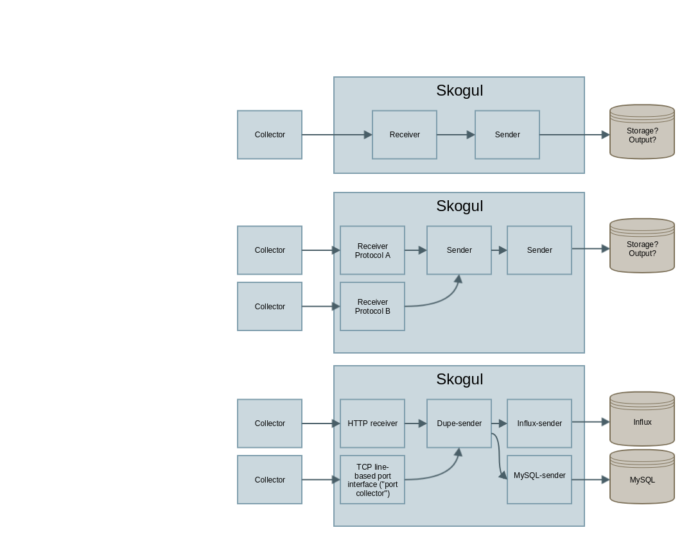
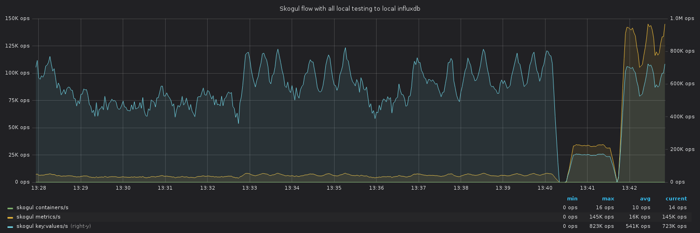

.. image:: https://goreportcard.com/badge/github.com/KristianLyng/skogul
   :target: https://goreportcard.com/report/github.com/KristianLyng/skogul

.. image:: https://godoc.org/github.com/KristianLyng/skogul?status.svg
   :target: https://godoc.org/github.com/KristianLyng/skogul

======================================
Skogul - generic metric/data collector
======================================

Skogul is a generic tool for moving metric data around. It can serve as a
collector of data, but is primarily designed to be a framework for building
bridges between data collectors and storage engines.

This repository contains the Skogul library/package, and ``cmd/skogul``,
which parses a JSON-config to set up Skogul.

A copy of the auto-generated manual for skogul is also provided, which is
aimed at end-users. See ``skogul.rst`` (or ``man ./skogul.1``).

.. contents:: Table of contents
   :depth: 2
   :local:

Quickstart
----------

You need to install a recent/decent version of Go. Either from your
favorite Linux distro, or through https://golang.org/dl/ .

Building ``skogul``, including cloning::

   $ git clone https://github.com/KristianLyng/skogul
   (...)
   $ cd skogul/cmd/skogul
   $ go build
   $ 
   # (No output from go build is good)

Alternatively, you can use ``go install`` instead of ``go build`` to
install to ``$GOPATH/bin``, which is typically ``~/go/bin``.

To use the locally imported/vendored packages instead of downloading them
directly, e.g. if a system does not have direct internet access or you wish
to take a local copy of the code in its entirety, including dependencies.
First make a vendored copy on an internet-attached computer - checksums in
the repo will be verified::

   $ cd skogul
   $ go mod vendor
   $
   ( skogul/vendor is now populated after a while )

Copy repo/directory to relevant computer, then run::

   $ cd skogul/cmd/skogul
   $ go build -mod vendor
   $

(or ``go install -mod vendor``)

About
-----

Skogul is written to solve a myriad of issues that typically arise when
dealing with metric data and complex systems. It can be used for very
simple setups, and expanded to large, multi-datacenter infrastructures with
a mixture of new and old systems attached to it.

To accomplish this, you set up chains that define how data is received, how
it is treated, where it goes and what happens if something goes wrong.

A Skogul chain is built from one or more independent receivers which
receive data and pass it on to a sender. A sender can either transmit data
to an external source (including an other Skogul instance), or add some
internal routing logic before passing it on to one or more other senders.

Unlike most APIs or collectors of metrics, Skogul does NOT have a
preference when it comes to storage engine. It is explicitly designed to
disconnect the task of how data is collected from how it is stored.

The rationale is that the problem of writing an efficient snmp collector
should not be tightly coupled to where you store the data. And where you
store the data should not be tightly coupled with how you receive it, or
what you do with it.

This enables an organization to gradually shift from older to newer stacks,
as Skogul can both receive data on old and new transport mechanisms,
and store it both in new and old systems. That way, older collectors can
continue working how they always how worked, but send data to Skogul.
During testing/maturing, Skogul can store the data in both legacy system
and replacement system. When the legacy system is removed, no change is
needed on the side of the collector.

Extra care has been put into making it trivial to write senders and
receivers. For example, an author of a new sender only has to add tags
to their data structure to have that exposed as documentation.

See the package documentation over at godoc for development-related
documentation: 
https://godoc.org/github.com/KristianLyng/skogul

End-user documentation is found in the manual page, which Skogul can
generate on demand, or you can review a copy on github: 
https://github.com/KristianLyng/skogul/blob/master/skogul.rst

More discussion on architecture can be found in `docs/`.

Performance
-----------

Skogul is meant to scale well. Early tests on a laptop proved to work very
well:

The above graph is from a very simple test on a laptop (with a quad core
i7), using the provided tester to write data to influxdb. It demonstrates
that despite well-known weaknesses at the time (specially in the
influx-writer), we're able to push roughly 600-800k values/s through
Skogul. This has since been exceeded.

The laptop in question was using about 150-190% CPU for skogul and 400% for
InfluxDB, the rest went to the testers. No real attempt at tuning was done,
but a few different scenarios were tested.

Note that the general values/s is decent both with a ton of values for each
metric, and just a handful of values per metric, but tons of metrics per
containers.

Update:

As of September 2019, TLS was enabled and Skogul was tested again, just for
TLS. Skogul was seen sending roughly 2 million key:values/s over HTTPS on
the same laptop. The batch sender has also proven to be very valuable.

Name
----

Skogul is a Valkyrie. After extensive research (5 minutes on Wikipedia with
a cross-check on duckduckgo), this name was selected because it is
reasonably unique and is also a Valkyrie, like Gondul, a sister-project.

Hacking
-------

There is little "exotic" about Skogul hacking, so the following sections
are aimed mostly at people who are unfamiliar with Go.

The first place to start is the top-level ``doc.go`` documentation, aimed
at developers.

.. note::

   The majority of all documentation is kept in godoc source comments, and
   available either in the code directly, through ``go doc
   github.com/KristianLyng/skogul`` or  through the web, at
   https://godoc.org/github.com/KristianLyng/skogul . This includes, but is
   not limited to example code and API documentation.

Testing
.......

To run test cases, ``go test`` can be run. This can be used either in
individual directories, or at the top directory, with ``go test ./...``
(note the triple dots. This is a go-ism for recursive behavior).

To produce coverage analysis, use::

   $ cd skogul
   $ go test ./... -covermode=count -coverprofile=coverage.out
   $ go tool cover -html coverage.out
   // Opens a browser with coverage anlysis

Be aware that the MySQL sender does not do integration testing by default,
as that requires a working MySQL instance.

Tests are extracted from ``*_test.go`` files, and start with the name
``Test`` followed by a function or data structure, optionally followed by
an underscore and an arbitrary name to support multiple tests of the same
function/type. E.g. ``TestValidate()``, ``TestHTTP_foobar()`` etc.

Runnable examples follow the same style, but are named Example, not Test.

Formatting etc
..............

The "go report" at the top of this document is a decent test of
marginal OK-ish-ness.

Tools you should use:

- `gofmt`, to format code according to Go coding style. Use ``gofmt -d .``
  see local diff, or ``gofmt -w .`` to fix it.
- `golint` to lint your code. ``golint .``

Installing these tools is left as an exercise to the reader.

Documentation
.............

Documentation comes in two forms. One is aimed at end-users. This is
provided mainly by adding proper labels to your data structures (see any
sender or receiver implementation), and through hard-coded text found in
``cmd/skogul/main.go``. In addition to this, stand-alone examples of setups
are provided in the ``examples/`` directory.

For development, documentation is written and maintained using code
comments and runnable examples, following the ``godoc`` approach. Some
architecture comments are kept in ``docs//``, but by and large,
documentation should be consumed from godoc.

See https://godoc.org/github.com/KristianLyng/skogul for the online
version, or use ``go doc github.com/KristianLyng/skogul`` or similar,
as you would any other go package.

Examples are part of the test suite and thus extracted from ``*_test.go``
where applicable.

Roadmap
-------

The configuration backend was just introduced. It took a few iterations,
but I don't anticipate noteworthy changes in the architecture going
forward.

The new configuration backend obsoleted a previous philosophy where complex
chains would only be available by writing the ``main``-function yourself,
while simple chains could be access through ``skogul-x2y``, which only
supported a small subset of senders/receivers.

This shift has meant that some documentation need to be changed. Things
that were exposed as godoc in the past was partially aimed at end-users,
and that is simply no longer the case.

An other thing that is sorely lacking is feedback to the end user when an
invalid configuration is provided. It is, at best, cryptic.

Time-wise, we hope to do a release in 2019 when we feel Skogul is mature
enough. It is already in use.
