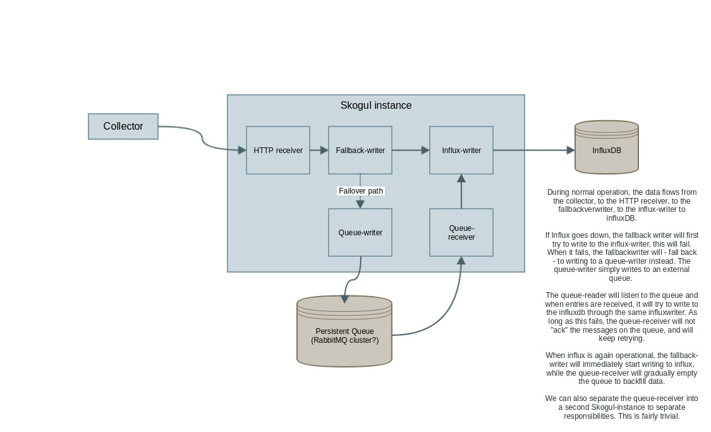
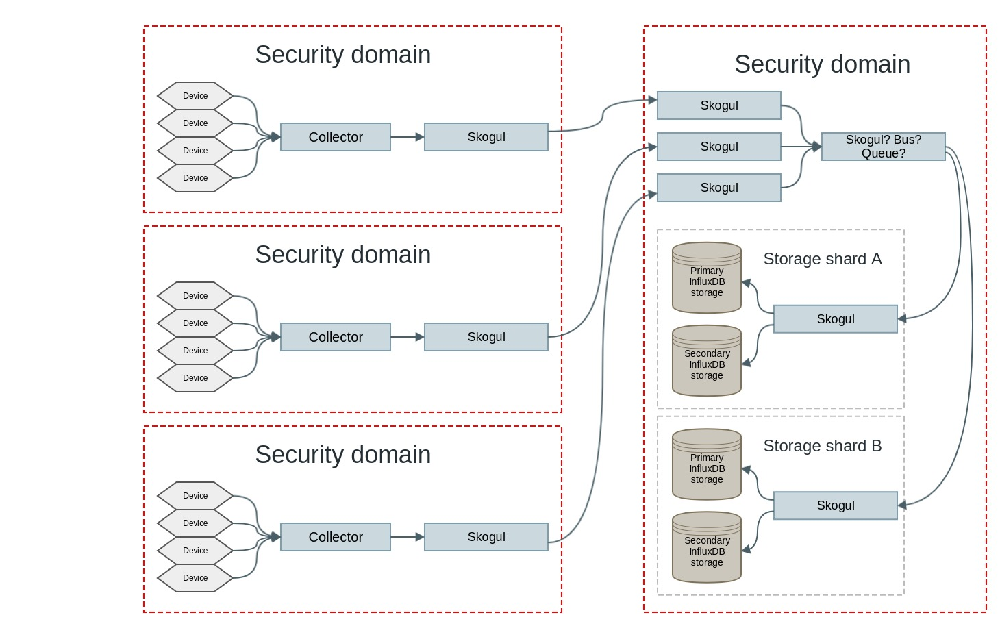

===================
Skogul architecture
===================

The Skogul architecture is designed around small primitives that pass
collections of metrics around. At present, there are four primitives:

- Receivers
- Transformers
- Senders
- Handlers

Receivers produce metrics. Typically by listening for input from external
sources, e.g.: the http receiver listens for metrics on a HTTP interface.

Handlers define how raw data is parsed, transforms (or mutate) the data,
then pass it on to a sender. Skogul currently support parsing it's own JSON
format, or Juniper Telemetry data. A handler is used by any source of data,
though the typical user is a receiver.

Transformers are executed by handlers and are used to transform input data.
They can mutate an existing collection of metrics, but can not direct where
output is sent and can not produce new collections. E.g.: While a
transformer can take metrics for a router, parse the tree and produce
per-interface statistics and more, it can NOT determine that
interfacestatistics will be sent to influxdb while other data will be sent
to postgres.

A sender accepts collections from a receiver and "ships it off". In the
canonical example, this means writing to backend storage, but a core
fundamental is of Skogul is the ability to chain multiple senders.
Continuing from the router-metric example above, the transformer can
interpret the SNMP data and produce individual metrics for each interface,
but a sender can take that data and send some parts on to an influx-sender
and other parts to a postgres-sender.

The real value of Skogul is the simplicity and chaining of senders.

.. warning::

   Skogul is still in its inception and many of the examples shown here are
   not yet implemented. This document is meant to demonstrate the
   architecture and potential, not necessarily existing or planned
   features.

Simple example
==============

The following diagram shows the architecture by examples.

.. image:: imgs/basic.png

The first diagram illustrates the simplest chain possible, with a single
receiver and a single sender. 

The second diagram demonstrates how Skogul can provide multiple different
receiver protocols to support collectors that emit data in different
formats.

The third example ties this together with multiple outputs. Two different
means of receiving data, they are both passed on to a (fictional) "dupe
sender" which simply takes the input and duplicates it to multiple senders:
influx-sender and mysql-sender.

Example: Queueing
=================

The power of Skogul lies in simplicity combined with simple primitives that
follow the UNIX-philosophy of doing one thing and doing it well. The
following illustrates how Skogul could provide robustness by using an
external queue combined with a "fallback writer".

Example: Multi-DC and queueing
==============================

To support multiple data centers, multiple servers and provide high
availability, the same mechanics as above can be further chained.

.. image:: imgs/fallback-2.jpg

Note that to avoid overly complex diagrams, the above does not deal with
redundancy with regards to influx.

Example: security zones
=======================

Another example, showing how metrics can be collected in three different
security zones, be piped into a "local" Skogul, shipped over to a central
security domain where dedicated Skogul instances can receive them (this is
just an example - a single Skogul instance could serve all three of them
too). Exactly how data gets from the three Skogul-instances to the
instances connected to Influx can then be mixed based on need. An early
implementation might for instance send directly from Skogul to Skogul,
while a later design might introduce a queue or bus-based architecture.

